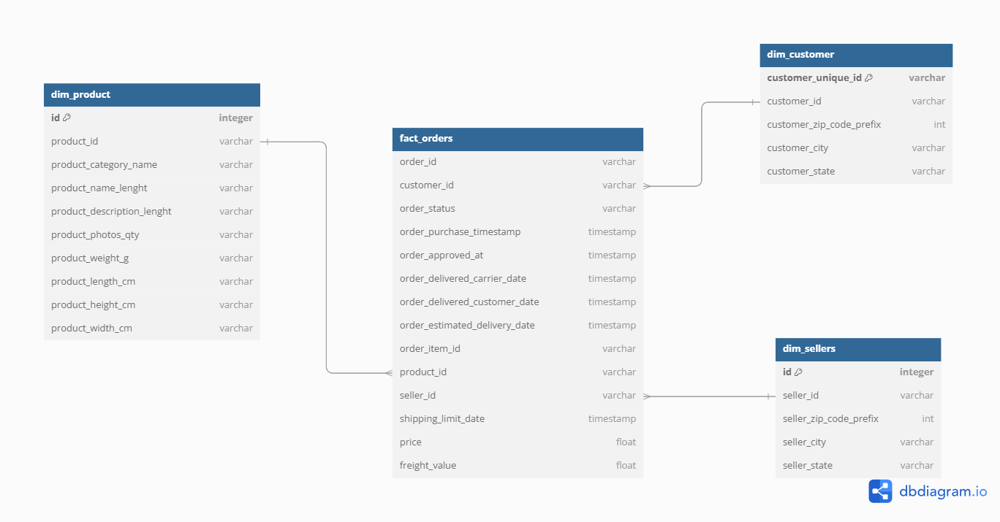
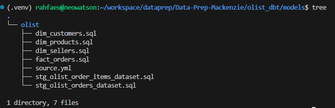

# MBA Engenharia de Dados - Mackenzie


### Integrantes:
| Nome                           |
|--------------------------------|
| Neoaquison Conceição Medeiros  |
| Rafael Medeiros dos Santos     |
| Samuel Silva Perumalswamy      |
| Gustavo Bido                   |

### 1 - Preparar o ambiente de execução
Clonar o repositório do projeto
``` bash
git clone https://github.com/rahfaeu/Data-Prep-Mackenzie.git
```

Entrar no diretório do projeto
``` bash
cd Data-Prep-Mackenzie
```

No diretório principal rodar os seguintes comando para criar o ambiente virtual

``` bash
python3 -m venv .venv
```

Para ativar o ambiente virtual, execute

``` bash
source .venv/bin/activate
```

Instale as bibliotecas do arquivo requirements.txt

``` bash
pip install -r requirements.txt
```

### 2 - Extrair dados do kaggle. 
Executar o comando abaixo para extrair as bases do kaggle e salvar local
``` bash
python3 script/get_kaggle_datasources.py 
```

### 3 - Criar o banco de dados 
Executar o comando abaixo para subir a imagem do postgres no docker
``` bash
docker compose up -d
```

### 4 - Inserir dados nas tabelas transacionais
``` bash
python3 script/df_to_database.py
```

### 5 - Modelagem dimensional (Star Schema)

Abaixo temos o diagrama da modelagem dimensional, consideramos o modelo de Ralph Kimball (Star Schema)



### 6 - Criação do fluxo de Transformação

Utilizamos o DBT como ferramenta de trasformação dos dados na camada analítica.

Criamos 6 modelos

- 2 Stagings
    - stg_olist_order_items_dataset
    - stg_olist_orders_dataset
- 3 Dimensões
    - dim_customers
    - dim_products
    - dim_sellers
- 1 Fato
    - fact_orders



Para materializar os modelos através do DBT, basta executar o seguinte comando:

``` bash
dbt run
```

--------------------------------------------------------------------------------

# Modelo Star Schema

## Tabela Fato: `fact_orders`

Centraliza as métricas principais para análise:

- `order_id` (PK)
- `customer_id` (FK para `dim_customers`)
- `seller_id` (FK para `dim_sellers`)
- `product_id` (FK para `dim_products`)
- `review_id` (FK para `dim_reviews`)
- `payment_sequential`
- `shipping_limit_date`
- `price`
- `freight_value`
- `payment_type`
- `payment_installments`
- `payment_value`
- `review_score`
- `order_status`
- `order_purchase_timestamp`
- `order_approved_at`
- `order_delivered_carrier_date`
- `order_delivered_customer_date`
- `order_estimated_delivery_date`

---

## Dimensão: `dim_customers`

Descreve os clientes:

- `customer_id` (PK)
- `customer_unique_id`
- `customer_zip_code_prefix`
- `customer_city`
- `customer_state`

---

## Dimensão: `dim_sellers`

Descreve os vendedores:

- `seller_id` (PK)
- `seller_zip_code_prefix`
- `seller_city`
- `seller_state`

---

## Dimensão: `dim_products`

Descreve os produtos:

- `product_id` (PK)
- `product_category_name` (FK para `dim_category_name`)
- `product_name_length`
- `product_description_length`
- `product_photos_qty`
- `product_weight_g`
- `product_length_cm`
- `product_height_cm`
- `product_width_cm`

---

## Dimensão: `dim_category_name`

Descreve as categorias de produtos:

- `product_category_name` (PK)
- `product_category_name_english`

---

## Dimensão: `dim_reviews`

Descreve as avaliações:

- `review_id` (PK)
- `review_score`
- `review_comment_title`
- `review_comment_message`
- `review_creation_date`
- `review_answer_timestamp`

---

## Dimensão: `dim_geolocation`

Descreve as localizações:

- `geolocation_zip_code_prefix` (PK)
- `geolocation_lat`
- `geolocation_lng`
- `geolocation_city`
- `geolocation_state`
